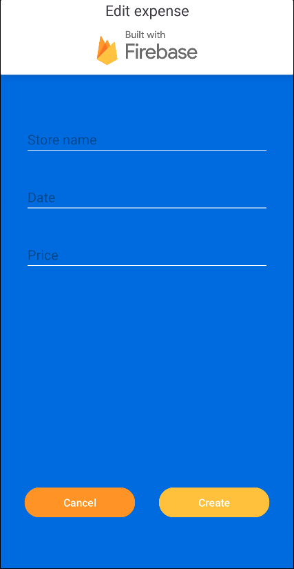
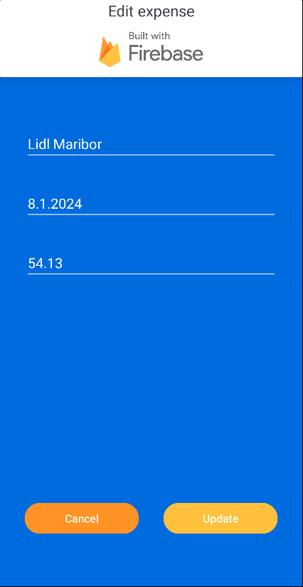

# Firebase Firestore demo app

**Firebase Firestore** je kot že ime pove, del spletne storitve (platform as a service) Firebase, ki
ponuja razne storitve kot so podatkovne baze v oblaku, avtentiacija, analitik itd. Ena izmed teh
podatkovnih baz je **Firestore**. Sam Firestore je fleksibilna in skalabilna podatkovna baza v
oblaku, ki se enostavno poveže tako z mobilnimi kot spletnimi aplikacijami pa tudi namiznimi
aplikacijami.

## Tehnični podatki

Firestore je NoSQL, realno časovna podatkovna baza, ki uporablja JSON-u podaobno strukturo podatkov.
Bolj natančno se podatki shranjujejo v t.i. kolekcije (_collections_), ki pa vsebujejo posamezne
dokumente (_documents_). Vsak posamezni dokument pa lahko vsebuje tudi pod-kolekcije (
_subcollections_), kar seveda omogoča shranjevanje kompleksnejših podatkov.

Kot je omenjeno je tudi Firestore realno časovna podatkovna baza tako kot tudi Firebase Realno
Časovna podatkovna baza (_Firebase Realtime database_), a se precej razlikujeta. Realnočasovna
podatkovna baza shranjuje podatke v eno veliko JSON drevo med tem ko Firestore shranjuje podatke v
kolekcije in dokumente (omenjeno zgoraj). Firestore omogoča tudi t.i. _Snapshot Listenerje_, (
prejšnja baza jih ne), to pa so v bistvu poslušalci, ki jih lahko programer doda posameznim
dokumentom in ti se bodo posodobili takoj, ko se ta dokument posodobi oziroma spremeni v samem
Firebasu.

Firestore je torej neke vrste nadgradnja Realnočasovne podatkovne baze in tudi sam Firebase (
_Google_) vsiljuje uporabo te novejše podatkovne baze (v večini primerov).

## Stroški uporabe

Če primerjamo obe bazi med seboj, realnočasovna baza uporablja stroške glede na hrambo podatkov,
Firestore pa stroške obračunava po principu procesiranje (branje, pisanje, brisanje podatkov).
Celotna Firebase platforma pa ima **Spark plan** (zastonj) in pa **Blaze Plan** (stroški po ceniku)
in sledi principu Pay-as-you-Go.

### **Firestore**

|                     |   Spark plan    |       Blaze plan       |
| :------------------ | :-------------: | :--------------------: |
| Shranjeni podatki   |      1 GiB      |    0.195$ GiB/Mesec    |
| Izhodi iz omrežja   |  10 GiB/Mesec   |         \*\*\*         |
| Pisanje dokumentov  | 20k pisanj/dan  | 0.117$/100k dokumentov |
| Branje dokumentov   |  50k branj/dan  | 0.039$/100k dokumentov |
| Brisanje dokumentov | 20k brisanj/dan | 0.013$/100k dokumnetov |

_\* Blaze park se začne obračunavati šele po prekoračitvi mej Spark Plan-a_

_\*\* Blaze plan se v primeru Firestora obračunava po ceniku Google Cloud Pricing-a, kar pa se od
regije do regije razlikuje. V zgornji tabeli so zabeležene cene za europe-central2 (Varšava)_

_\*\*\* Cenik za "izhode iz omrežij se obračunavajo drugače za vsako omrežje, več
na [Google Cloud Pricing](https://cloud.google.com/firestore/pricing#firestore-pricing),
odstavek **Internet data transfer rates**"_

### **Realtime Database**

|                     | Spark plan  |       Blaze plan       |
| :------------------ | :---------: | :--------------------: |
| Št. hratnih povezav |     100     | 200k / podatkovno bazo |
| Shranjenih GB       |    1 GB     |         5$/GB          |
| Prenesenih GB       | 10 GB/Mesec |         1$/GB          |
| Več baz na projektu |     ❌      |           ✅           |

## Prednosti in slabosti

|                 Prednosti                  |            Slabosti             |
| :----------------------------------------: | :-----------------------------: |
| Realnočasovne posodobitve (sinhronizacija) | Omejene poizvedbe (napram SQL)  |
|         Skalabilnost (avtomatsko)          |       Struktura podatkov        |
|          "Serverless" arhitektura          |             Stroški             |
|    Podpora mnogih jezikov in platformn     |      Omejeno indeksiranje       |
|            Način brez povezave             | Brez transakcij med kolekcijami |
|              "Security rules"              |                                 |

Torej Firestore podatkovno bazo je smiselno uporabiti za hiter razvoj aplikacij neodvisno od
platforme. Problemi se lahko pojavijo pri večjih aplikacijah in sistemih, ki zahetvajo veliko
število prilagoditev in natančnega načrtovanja.

## Namestitev

Za uporabo Firestore-a je najprej potreban namestitev celotnega Firebase sistema in sicer je treba
najprej registrirati aplikacijo v Firebase konzoli. Po uspešni registraciji nam spletna storitev
generira _google-services.json_ datoteko, ki jo vstavimo v **modul** na **ravni aplikacije**.

V primeru skupnega projekta se lahko `google-services.json` doda na git repozitorij, v primeru
javnega ali odprtokodnega projekta pa mora vsak uporabnik priskrbeti svojo `google-services.json`
datoteko.

Nato v korenskem modulu dodamo nov _plugin_ v datoteko `build.gradle`:

```kotlin
plugins {
    id("com.android.application") version "7.3.0" apply false
    // ...

    // Add the dependency for the Google services Gradle plugin
    id("com.google.gms.google-services") version "4.4.0" apply false
}
```

V aplikacijskem modulu je prav tako potrebno dodati _plugin_(1) in pa odvisnosti (2), oboje  
v `build.gradle`:

```kotlin
plugins {
    id("com.android.application")
    // Add the Google services Gradle plugin    id("com.google.gms.google-services")
}
```

```kotlin
dependencies {
    // ...
    // Import the Firebase BoM    implementation(platform("com.google.firebase:firebase-bom:32.7.0"))
    // When using the BoM, you don't specify versions in Firebase library dependencies
    // Add the dependency for the Firebase SDK for Google Analytics
    implementation("com.google.firebase:firebase-analytics")    // Storitev za analitiko (poljubno)

    // TODO: Add the dependencies for any other Firebase products you want to use
    // See https://firebase.google.com/docs/android/setup#available-libraries
    // For example, add the dependencies for Firebase Authentication and Cloud Firestore
    implementation("com.google.firebase:firebase-firestore")    // Firestore storitev
    implementation("com.google.firebase:firebase-auth")         // Druga sotritev - avtentikacija
}
```

## Uporaba (enostavne akcije)

Za enostavno branje, pisanje in brisanje podatkov (_CRUD operacije_) je uporaba otročje lahka, a
potrebno je paziti na obliko in tip podatkov med samim shranjevanje in branjem. Firestore v primeru
Android aplikacije (Kotlin) uporablja podatkovni tip `HashMap<String, String>` in pri samem pisanju
samodejno pretvori Kotlin objekte v tovrstni tip podatkov, pri branju pa moramo za to poskrbeti
sami.

- ### Branje celotne kolekcije

```kotlin
Firebase.firestore
    .collection("IME_KOLEKCIJE")
    .get()
    .addOnSuccessListener { collectionSnapshot ->
        // Koda, ki se izvede  ob uspešnem branju kolekcije
    }
    .addOnErrorListener { exception ->
        // Koda, ki se izvede ob napaki
    }
```

- ### Branje posameznih dokumentov

```kotlin
Firebase.firestore
    .collection("IME_KOLEKCIJE")
    .document("ID_DOKUMENTA")
    .get()
    .addOnSuccessListener { collectionSnapshot ->
        // Koda, ki se izvede  ob uspešnem branju dokumenta
    }
    .addOnErrorListener { exception ->
        // Koda, ki se izvede ob napaki
    }
```

<br />

|                  Aplikacija ob zagonu                  |      Aplikacija ko se naloži celotna kolekcija       |
| :----------------------------------------------------: | :--------------------------------------------------: |
|  |  |

<br />

- ### Ustvarjanje novih dokumentov

```kotlin
// Metoda, ki ustvari dokument in avtomatsko dodeli ID dokumenta
Firebase.firestore
    .collection("IME_KOLEKCIJE")
    .add("OBJEKT")
    .addOnSuccessListener { collectionSnapshot ->
        // Koda, ki se izvede  ob uspešnem ustvarjanju dokumenta
    }
    .addOnErrorListener { exception ->
        // Koda, ki se izvede ob napaki
    }

// Metoda pri kateri programer sam doda ID dokumenta
Firebase.firestore
    .collection("IME_KOLEKCIJE")
    .document("ID DOKUMENTA")
    .set("OBJEKT")
    .addOnSuccessListener { void ->
        // Koda, ki se izvede  ob uspešnem ustvarjanju dokumenta
    }
    .addOnErrorListener { exception ->
        // Koda, ki se izvede ob napaki
    }
```

<br />
<p align="center">
    
</p>
<br />

- ### Posodabljanje že obstoječih dokumentov

```kotlin
Firebase.firestore
    .collection("ime-kolekcije")
    .document("ID_DOKUMENTA")
    .update(
        "KLJUČ", "VREDNOST",
        "DRUGI_KLJUČ", "DRUGA_VREDNOST",
        // ...
    )
    .addOnSuccessListener { void ->
        // Koda, ki se izvede  ob uspešni posodobitvi dokumenta
    }
    .addOnErrorListener { exception ->
        // Koda, ki se izvede ob napaki
    }
```

<br />
<p align="center">
    
</p>
<br />

- ### Brisanje podatkov

```kotlin
Firebase.firestore
    .collection("ime-kolekcije")
    .document("ID_DOKUMENTA")
    .delete()
    .addOnSuccessListener { void ->
        // Koda, ki se izvede  ob uspešnem brisanju dokumenta
    }
    .addOnErrorListener { exception ->
        // Koda, ki se izvede ob napaki
    }
```

## Posodobitve in vzdrževanje projekta

Firebase Firestore je zagotovo živ projekt, saj dobiva konstantne posodobitve in sicer najmanj 2 na
mesec, bodisi dodatek novih funkcionalnosti, bodisi popravki prejšnje kode. Zadnja posodobitev (
_7.1.2024_) je bila 2.1.2024. Vse posodobitve so tudi zabeležene na njihovih
_[Release Notes](https://cloud.google.com/firestore/docs/release-notes)_.

Glede na podatke
iz [Firebase Blog](https://firebase.blog/posts/2020/10/whats-new-at-firebase-summit-2020#:~:text=Last%20year%2C%20we%20shared%20that,as%20innovative%20startups%20like%20Classkick.),
iz dne 27.10.2020, je platformo Firebase uporabljalo več kot 2.5 milijona aplikacij. Leto prej pa so
zabeležili okroglih 2 milijona aplikacij. Točnega podatka za sam Firestore ni na voljo, lahko pa se
sklepa za velika večina teh aplikacij uporablja Firestore, saj je to poleg Realnočasovne podatkovne
baze glavna storitev te platforme.

## Licenca

Firebase Firestore je licenčni produkt in ima svoje pogoje uporabe objavljene
na [Google Cloud Platform Terms of Service](https://cloud.google.com/terms/).

**Med pomembnejšimi pogoji so recimo:**

- Stranka (programer) ne bo in ne sme omogočiti svojim končnim uporabnikom kopiranja,
  modificiranja  
  ali ustvarjanja izpeljanih različic teh storitev, izvajal obratnega inženirstva (_reverse
  engineering_) ali katerih koli drugih metod pridobivanja izvorne kode storitev.

- Stranka (programer) je v celoti sam odgovoren za zagotavljanje zasebnosti poatkov svojih končnih  
  uporabnikov

## Vključenost v projekt

Sam Firestore in pa poleg njega še vrsto drugih storitev Firebase platorfme, uporabljam v svojem
privatnem projektu, namenjen strankam in zaposlenim podjetja Jokra d.o.o. Spetna stran je dosegljiva
na [Jokra.si](https://jokra.si).
Aplikacija je kot nekakšen klon Google Drive-a, OneDrive-a, a prilagojena potrebam omenjenega
podjetja.

---

### Izgled aplikacije (dostopno samo strankam in zaposlenim)


- Na sliki je podan testni prikaz aplikacije

---

### Prikaz v kodi

Primer Firebase konfiguracije (uporaba .env datoteke za povecčano zaščito, kljub navedbam Googla, da
ni nevarno če so ti podatki javni):


Lastno implemntiran Firebase ORM (_object relational mapping_):


---

### Prikaz Firebase konzole

Na spodnji sliki je prikaz strukture Firestore kolekcij in dokumnetov iz kolekcije _companies_:


